Validation: 
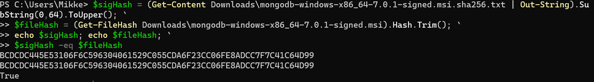

**Experiment 1**

Insert one: 
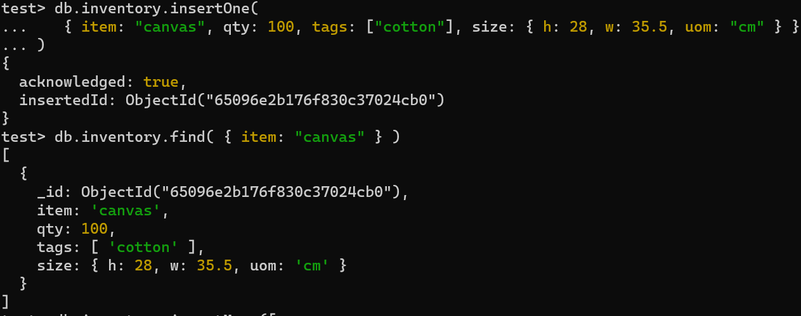

Insert many: 
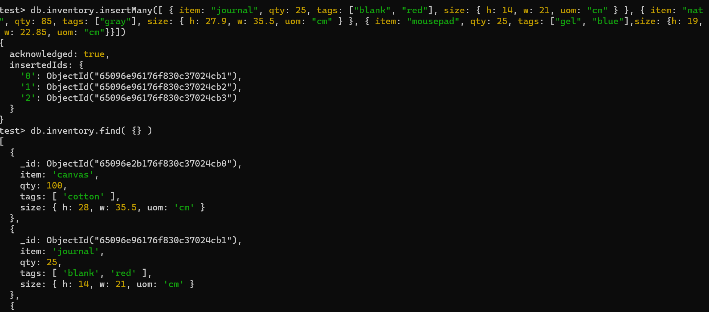

Find specific values: 
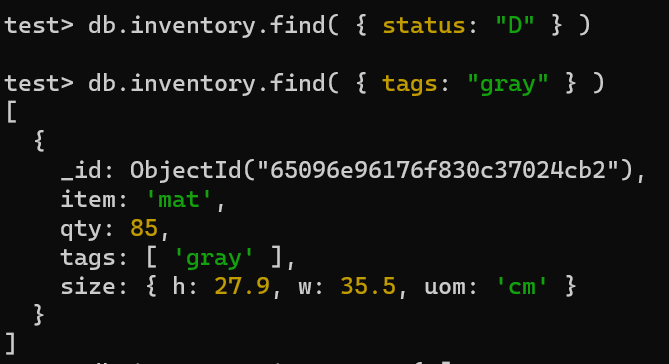

Update one and update many: 
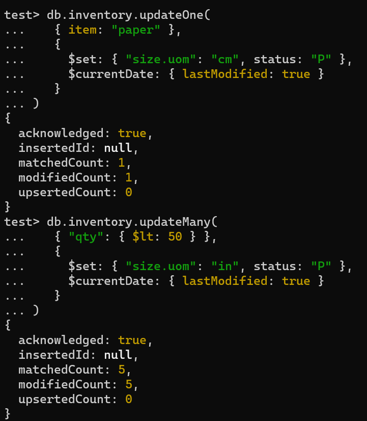

Replace: 
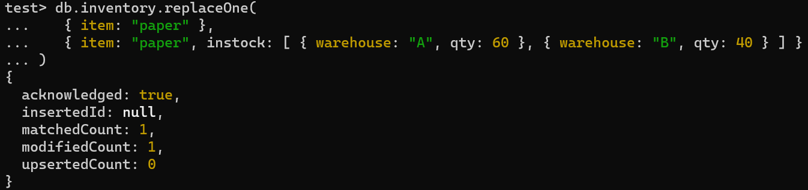

Delete:
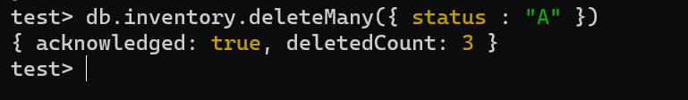

**Experiment 2**

Return the total price per customer example: 
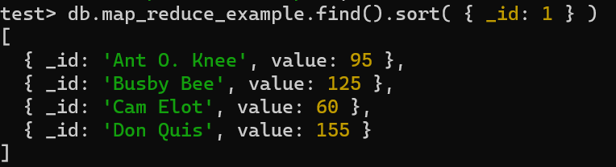

Example 2 Calculate Order and Total Quantity with Average Quantity Per Item: 
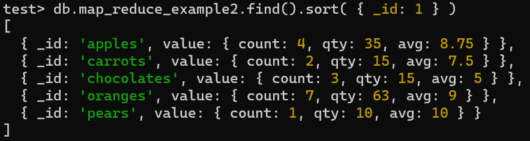

I created a map.reduce to find the average price: 

mapfunction:

Reducefuntion:
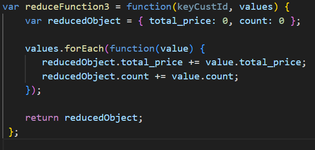

mapReduce
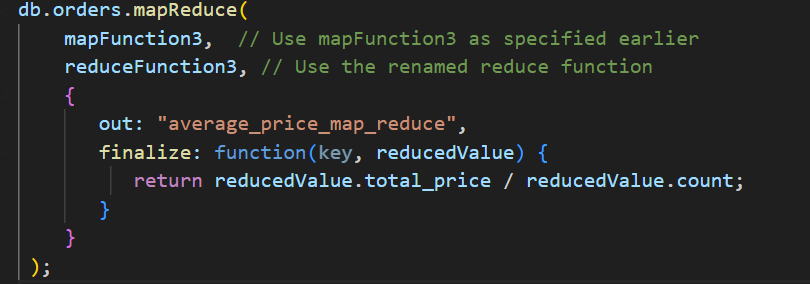

This gave me: 
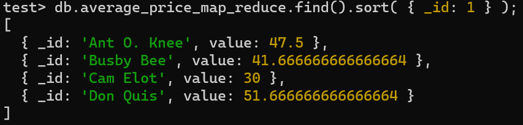

The implemented map reduce function is useful for calculating the average price per customer. This information is valuable for understanding customer spending patterns.

For example we now know that Ant O. Knee spends roughly 47.5 per order.